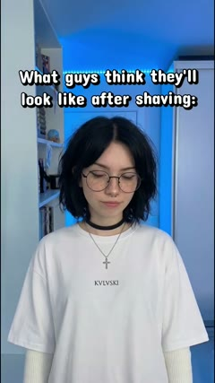
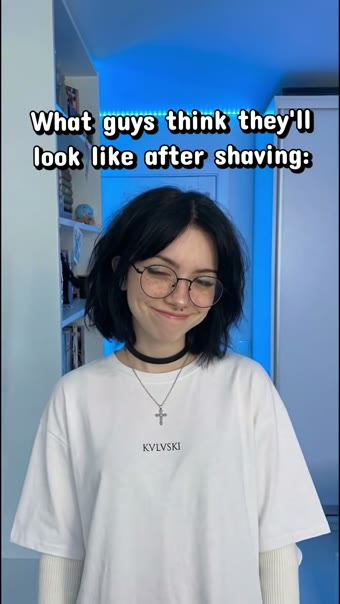
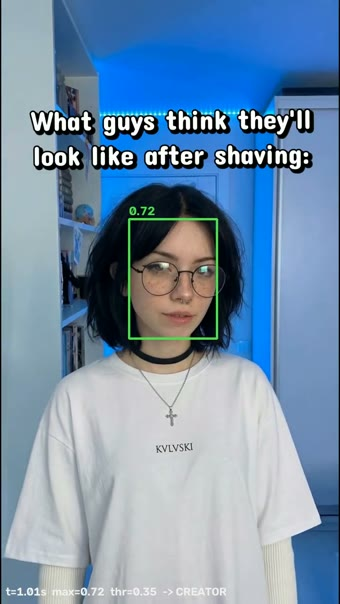
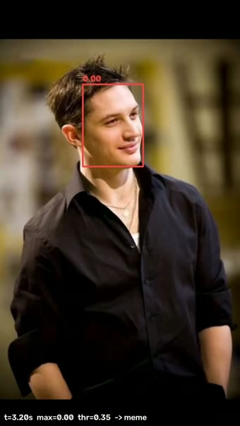

# pezevid

Cut detection over vertical TikTok clips — find the person→meme shot boundary and every
creator *return*.

Traced below on clip `fa68486e668e` with real per-stage I/O. Dataset: **121 clips**, 720×1280,
variable fps (TikTok re-encodes, ~8 s each). The pipeline reads each clip's native fps and works
in **seconds** throughout, so timestamps are comparable across clips.

| fps | 30.00 | 26.42 | 28.83 | 24.00 | 19.17 | 16.83 |
|-----|-------|-------|-------|-------|-------|-------|
| clips | 57 | 38 | 11 | 11 | 3 | 1 |

---

## Output — `segments.json`

| # | label | start (s) | end (s) | face_sim |
|---|-------|-----------|---------|----------|
| 01 | person | 0.000 | 2.625 | 0.748 |
| 02 | meme | 2.625 | 6.625 | 0.000 |
| 03 | person | 6.625 | 7.917 | 0.674 |
| 04 | meme | 7.917 | 10.500 | 0.000 |

`pattern: pers→meme→pers→meme` · cuts at **2.625 / 6.625 / 7.917 s**

<table>
<tr>
<td align="center"><br><sub><b>01 person</b><br>0.0–2.625 · sim .748</sub></td>
<td align="center"><br><sub><b>02 meme</b><br>2.625–6.625 · sim .00</sub></td>
<td align="center"><br><sub><b>03 person</b> (return)<br>6.625–7.917 · sim .674</sub></td>
<td align="center"><br><sub><b>04 meme</b><br>7.917–10.5 · sim .00</sub></td>
</tr>
</table>

---

# Pipeline

```bash
docker compose run --rm all      # detect → relabel → segment → split → report
```

### 1. Shot boundaries — TransNetV2
Writes `transitions/transitions.json`.

The person→meme handoff **is a shot boundary**. TransNetV2 detects boundaries directly; labeling
only decides which one. All times on the true per-frame PTS clock (not `int(t·avg_fps)`) — VFR clips
drift up to 0.83 s under an avg-fps clock.

- 6 shots; first hard cut at **2.625 s**.
- Flags: `--threshold 0.5` (cut sensitivity), `--lowthr-redetect 0.4` (single-shot rescue).

```
shots (s): 0.000–2.583 · 2.625–3.792 · 3.833–5.250 · 5.292–6.583 · 6.625–7.917 · 7.917–10.458
```

<table>
<tr>
<td align="center"><br><sub>last person frame · <b>2.583 s</b></sub></td>
<td align="center"><br><sub>first meme frame · <b>2.625 s</b> — the boundary</sub></td>
</tr>
</table>

### 2. Face labeling — InsightFace / SCRFD
Rewrites `transitions.json` with per-shot labels (+ `--qa` before/after frames).

Same creator every clip, so shots are scored by **her face** (cosine vs an enrolled centroid), not by
content. Memes often contain a face — a prior CLIP labeler was fooled by that; cosine is not.

- Flags: `--det-size 640` (+0.8 pts), `--face-threshold 0.35`, `--frames-per-shot 3`.

<table>
<tr>
<td align="center"><br><sub>creator · sim <b>0.72 ≥ 0.35</b> → <b>person</b></sub></td>
<td align="center"><br><sub>different face · sim <b>0.00 &lt; 0.35</b> → <b>meme</b></sub></td>
</tr>
</table>

### 3. Cut selection — `pick()`
Base pick: best **creator-prefix → meme-suffix** split → `transition_sec`. Four guards handle
off-shape clips; none fabricates a cut on creator-less footage.

| condition | action | method |
|-----------|--------|--------|
| no leading creator shot | domain prior: creator always opens → take first cut | `creator_to_meme_prior` |
| no hard cut / creator+meme merged | dense face scan, ≤2.5 s move only | `creator_to_meme_soft` |
| single shot, nothing found | re-detect that clip at `--lowthr-redetect 0.4`, re-pick | — |
| her face nowhere above evidence floor | stay silent (genuinely creator-less) | `all_meme_no_creator` |

### 4. Segmentation — 2-state Viterbi
Writes `transitions/segments.json`, `segments/<clip>/NN_<label>.mp4`.

Global decode over a dense creator-sim curve: **2-state person↔meme Viterbi**, strict alternation
(no meme→meme cuts) + one switch penalty. Recovers the **creator return at 6.625 s** that raw shot
labels drop (segment 03, 1.3 s). Soft fades snapped to the luma-neutral frame.

- Two steps: `--dump-curves` (GPU, once) → segment from cache (no GPU).
- Knobs: `--thr` (center), `--switch-pen` (hysteresis). True-PTS placement: mean |Δ| **0.13 → 0.068 s**.

### 5. Split / evaluate / report
Binary transition → `split/person/`, `split/meme/`. `evaluate.py` scores the full cut sequence vs
manual GT (`--tol 0.5`). `app.html` — live workbench (ticks, picked cut, per-segment playback);
`build_report.py` → static `report.html`.

---

## Metrics

**Cut** — vs manual cut-editor GT (n=121), multi-cut aware, `--tol 0.5`:

| stage | full-sequence | first-cut | error |
|-------|---------------|-----------|-------|
| stage-3 segments (`face_cut`) | **99.2 %** (120/121) | 100 % | mean \|Δ\| **0.068 s** |
| stage-2 pick (`relabel_faces`) | 95.9 % (116/121) | 98.3 % | precision 95.8 % / recall 96.6 % |

0 false positives on creator-less clips. Two blind verification passes reviewed all 121 clips
frame-by-frame (manual pass scored 98.3 %, surfaced 8 GT mistakes, since corrected —
`transitions/verification.json`).

## `method` values (`transitions.json`)
`creator_to_meme` · `creator_to_meme_prior` · `creator_to_meme_soft` / `_softcut` ·
`single_shot_creator` / `all_creator_no_transition` · `all_meme_no_creator`.

## Repo layout
```
src/          compute pipeline (GPU, in-container): detect_transitions, relabel_faces,
              face_cut, split_clips, evaluate
./            web app + orchestration: serve.py, build_report.py, peznav.py/.css,
              index/app/editor.html, vendor/, Docker* / compose / requirements
tools/        re-runnable utilities: debug_faces.py, blank_unaddressed_cuts.py
transitions/  data — ground-truth JSON (tracked) + generated transitions.json / segments.json
examples/     the frames used in this README
```
Compute scripts anchor data paths at the repo root (`Path(__file__)…parent.parent`), so
`transitions/`, `freckled_spike_tiktok/`, `split/`, `segments/` resolve regardless of `src/` nesting.

## Run it — Docker
```bash
docker compose build                         # one-time (cached after)
docker compose run --rm all                  # full pipeline
docker compose run --rm {detect|relabel|segment|split|report}   # single stage
docker compose up serve                      # UI at http://localhost:8000/  (or ./serve.sh)
```
No compose? `./docker-run.sh src/detect_transitions.py` (`GPU=0` forces CPU). Both stages use the
GPU with the NVIDIA runtime and fall back to CPU on an actual visible-device check. TransNetV2 +
buffalo_l are baked in — runs are offline.
